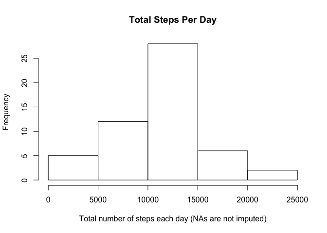
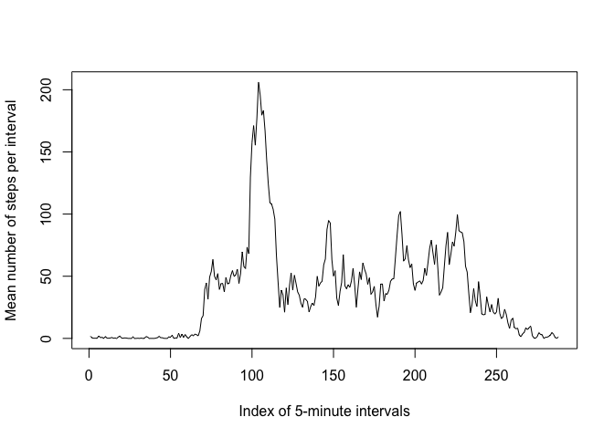
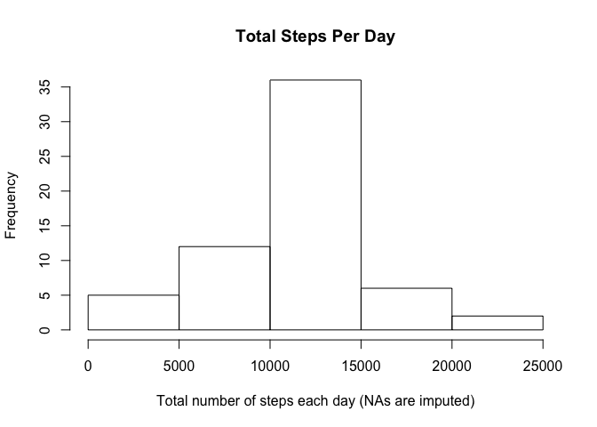
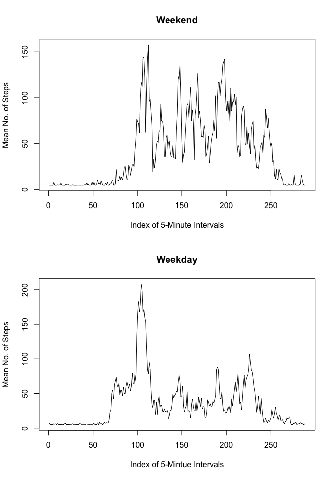

Loading and preprocessing the data
==================================

Over and above the normal data load, I feel that the interval value
needs to be converted to an index value from 1 to 288 to reflect the 288
5-minute time 'slices' per day. That was done in this section. I also
created a baseline dataset for non-imputed NAs (data) and imputed NAs
(data1), respectively.

    library(plyr)
    library(dplyr)

    ## 
    ## Attaching package: 'dplyr'

    ## The following objects are masked from 'package:plyr':
    ## 
    ##     arrange, count, desc, failwith, id, mutate, rename, summarise,
    ##     summarize

    ## The following objects are masked from 'package:stats':
    ## 
    ##     filter, lag

    ## The following objects are masked from 'package:base':
    ## 
    ##     intersect, setdiff, setequal, union

    library(data.table)

    ## 
    ## Attaching package: 'data.table'

    ## The following objects are masked from 'package:dplyr':
    ## 
    ##     between, last

    library(knitr)

    ## Warning: package 'knitr' was built under R version 3.2.5

    knitr::opts_chunk$set(cache = TRUE, fig.width = 7, fig.height = 5, fig.path = "figure-")

    setwd('~/documents/reproducible_research/week2')
    data <- unzip("repdata_data_activity.zip")
    data <- read.csv(data, header=T, sep=",", na.strings = "NA", stringsAsFactors = F)
    data <- as.data.frame(data)
    names(data) <- c("steps","date","interval")
    data <- data[ ,c(2,1,3)]

    #convert 'interval' to an index from 1 to 288 (288 is the total number of 5-minute intervals in a 24-hour period)
    data1 <- as.data.frame(data)
    data_gp <- group_by(data, date)

    m <- nrow(data)
    n <- rep(1:288, times = 61)

    for (o in 1:m) 
      data_gp[o,]$interval[1] <- n[o]

    data <- as.data.frame(data_gp) #baseline dataset where NAs will not be imputed
    data1 <- data #baseline dataset where NAs will be imputed

What is mean total number of steps taken per day?
=================================================

    stp <- data$steps
    stpn <- length(stp) #total number of records in dataset including NAs
    stp1 <- na.omit(stp) #omit NAs from data
    stpn1 <- length(stp1) #number of records after omitting NAs

    ms <- mean(stp1) #mean value of steps in dataset after omitting NAs
    data <- na.omit(data) #strip all NAs from data
    #data <- arrange(data, date, steps)
    data_gp <- group_by(data, date) #redo the group by command after omitting NAs

Here is the total number of steps taken per day, ignoring (omitting)
NAs. In this dataframe, we only have 53 records out of the full dataset
with 61 dates. That's because 8 of the dates do not have any intervals
with a step value--they're all NAs.

    data_gp_sum  <- summarise(data_gp, sum(steps))
    print(as.data.frame(data_gp_sum))

    ##          date sum(steps)
    ## 1  2012-10-02        126
    ## 2  2012-10-03      11352
    ## 3  2012-10-04      12116
    ## 4  2012-10-05      13294
    ## 5  2012-10-06      15420
    ## 6  2012-10-07      11015
    ## 7  2012-10-09      12811
    ## 8  2012-10-10       9900
    ## 9  2012-10-11      10304
    ## 10 2012-10-12      17382
    ## 11 2012-10-13      12426
    ## 12 2012-10-14      15098
    ## 13 2012-10-15      10139
    ## 14 2012-10-16      15084
    ## 15 2012-10-17      13452
    ## 16 2012-10-18      10056
    ## 17 2012-10-19      11829
    ## 18 2012-10-20      10395
    ## 19 2012-10-21       8821
    ## 20 2012-10-22      13460
    ## 21 2012-10-23       8918
    ## 22 2012-10-24       8355
    ## 23 2012-10-25       2492
    ## 24 2012-10-26       6778
    ## 25 2012-10-27      10119
    ## 26 2012-10-28      11458
    ## 27 2012-10-29       5018
    ## 28 2012-10-30       9819
    ## 29 2012-10-31      15414
    ## 30 2012-11-02      10600
    ## 31 2012-11-03      10571
    ## 32 2012-11-05      10439
    ## 33 2012-11-06       8334
    ## 34 2012-11-07      12883
    ## 35 2012-11-08       3219
    ## 36 2012-11-11      12608
    ## 37 2012-11-12      10765
    ## 38 2012-11-13       7336
    ## 39 2012-11-15         41
    ## 40 2012-11-16       5441
    ## 41 2012-11-17      14339
    ## 42 2012-11-18      15110
    ## 43 2012-11-19       8841
    ## 44 2012-11-20       4472
    ## 45 2012-11-21      12787
    ## 46 2012-11-22      20427
    ## 47 2012-11-23      21194
    ## 48 2012-11-24      14478
    ## 49 2012-11-25      11834
    ## 50 2012-11-26      11162
    ## 51 2012-11-27      13646
    ## 52 2012-11-28      10183
    ## 53 2012-11-29       7047

Here is a histogram of the total number of steps taken each day when
ignoring NAs. Most (frequency 25) cluster around taking between 10,000
and 15,000 steps per day.

    names(data_gp_sum) <- c("date","sum_steps")
    data_sum <- data_gp_sum$sum_steps
    hist(data_sum, main = "Total Steps Per Day", xlab = "Total number of steps each day (NAs are not imputed)")

Below are reports of the mean and median of the total number of steps
taken per day (mean/median steps taken per interval).

    data_gp_mean <- summarise(data_gp, mean(steps))
    data_gp_median <- summarise(data_gp, median(steps))
    print(as.data.frame(data_gp_mean))

    ##          date mean(steps)
    ## 1  2012-10-02   0.4375000
    ## 2  2012-10-03  39.4166667
    ## 3  2012-10-04  42.0694444
    ## 4  2012-10-05  46.1597222
    ## 5  2012-10-06  53.5416667
    ## 6  2012-10-07  38.2465278
    ## 7  2012-10-09  44.4826389
    ## 8  2012-10-10  34.3750000
    ## 9  2012-10-11  35.7777778
    ## 10 2012-10-12  60.3541667
    ## 11 2012-10-13  43.1458333
    ## 12 2012-10-14  52.4236111
    ## 13 2012-10-15  35.2048611
    ## 14 2012-10-16  52.3750000
    ## 15 2012-10-17  46.7083333
    ## 16 2012-10-18  34.9166667
    ## 17 2012-10-19  41.0729167
    ## 18 2012-10-20  36.0937500
    ## 19 2012-10-21  30.6284722
    ## 20 2012-10-22  46.7361111
    ## 21 2012-10-23  30.9652778
    ## 22 2012-10-24  29.0104167
    ## 23 2012-10-25   8.6527778
    ## 24 2012-10-26  23.5347222
    ## 25 2012-10-27  35.1354167
    ## 26 2012-10-28  39.7847222
    ## 27 2012-10-29  17.4236111
    ## 28 2012-10-30  34.0937500
    ## 29 2012-10-31  53.5208333
    ## 30 2012-11-02  36.8055556
    ## 31 2012-11-03  36.7048611
    ## 32 2012-11-05  36.2465278
    ## 33 2012-11-06  28.9375000
    ## 34 2012-11-07  44.7326389
    ## 35 2012-11-08  11.1770833
    ## 36 2012-11-11  43.7777778
    ## 37 2012-11-12  37.3784722
    ## 38 2012-11-13  25.4722222
    ## 39 2012-11-15   0.1423611
    ## 40 2012-11-16  18.8923611
    ## 41 2012-11-17  49.7881944
    ## 42 2012-11-18  52.4652778
    ## 43 2012-11-19  30.6979167
    ## 44 2012-11-20  15.5277778
    ## 45 2012-11-21  44.3993056
    ## 46 2012-11-22  70.9270833
    ## 47 2012-11-23  73.5902778
    ## 48 2012-11-24  50.2708333
    ## 49 2012-11-25  41.0902778
    ## 50 2012-11-26  38.7569444
    ## 51 2012-11-27  47.3819444
    ## 52 2012-11-28  35.3576389
    ## 53 2012-11-29  24.4687500

    print(as.data.frame(data_gp_median))

    ##          date median(steps)
    ## 1  2012-10-02             0
    ## 2  2012-10-03             0
    ## 3  2012-10-04             0
    ## 4  2012-10-05             0
    ## 5  2012-10-06             0
    ## 6  2012-10-07             0
    ## 7  2012-10-09             0
    ## 8  2012-10-10             0
    ## 9  2012-10-11             0
    ## 10 2012-10-12             0
    ## 11 2012-10-13             0
    ## 12 2012-10-14             0
    ## 13 2012-10-15             0
    ## 14 2012-10-16             0
    ## 15 2012-10-17             0
    ## 16 2012-10-18             0
    ## 17 2012-10-19             0
    ## 18 2012-10-20             0
    ## 19 2012-10-21             0
    ## 20 2012-10-22             0
    ## 21 2012-10-23             0
    ## 22 2012-10-24             0
    ## 23 2012-10-25             0
    ## 24 2012-10-26             0
    ## 25 2012-10-27             0
    ## 26 2012-10-28             0
    ## 27 2012-10-29             0
    ## 28 2012-10-30             0
    ## 29 2012-10-31             0
    ## 30 2012-11-02             0
    ## 31 2012-11-03             0
    ## 32 2012-11-05             0
    ## 33 2012-11-06             0
    ## 34 2012-11-07             0
    ## 35 2012-11-08             0
    ## 36 2012-11-11             0
    ## 37 2012-11-12             0
    ## 38 2012-11-13             0
    ## 39 2012-11-15             0
    ## 40 2012-11-16             0
    ## 41 2012-11-17             0
    ## 42 2012-11-18             0
    ## 43 2012-11-19             0
    ## 44 2012-11-20             0
    ## 45 2012-11-21             0
    ## 46 2012-11-22             0
    ## 47 2012-11-23             0
    ## 48 2012-11-24             0
    ## 49 2012-11-25             0
    ## 50 2012-11-26             0
    ## 51 2012-11-27             0
    ## 52 2012-11-28             0
    ## 53 2012-11-29             0

What is the average daily activity pattern?
===========================================

This is a time series plot (i.e. 𝚝𝚢𝚙𝚎 = "𝚕") of the 5-minute interval
(x-axis) and the average number of steps taken, averaged across all days
(y-axis).

    data_gp1 <- group_by(data, interval)
    data_gp1_mean <- summarise(data_gp1, mean(steps))

    cols <- c("interval", "mean_steps")
    names(data_gp1_mean) <- cols

    dt_gp1_int <- data_gp1_mean$interval
    dt_gp1_steps <- data_gp1_mean$mean_steps

    plot.ts(dt_gp1_int, dt_gp1_steps, type = "l", xlab = "Index of 5-minute intervals", ylab = "Mean number of steps per interval")

The code below produces the 5-minute interval on average across all the
days in the dataset which contains the maximum number of steps? It
occurs in the 104th interval (around 9 a.m.) where the number of steps
averages over 200.

    names(data_gp1_mean) <- c("interval", "mean_steps")
    q <- which.max(data_gp1_mean$mean_steps)
    print(data_gp1_mean[q,])

    ## Source: local data frame [1 x 2]
    ## 
    ##   interval mean_steps
    ##      (int)      (dbl)
    ## 1      104   206.1698

Imputing missing values
=======================

The goal of this section is to create a new dataset that is equal to the
original dataset but with the missing data filled in. First, we'll
calculate and report the total number of missing values in the dataset,
i.e. the total number of rows with NAs.

    ttlna <- stpn - stpn1 #total NAs in dataset
    print(ttlna) # total NAs in the dataset

    ## [1] 2304

    print(ttlna/stpn) # percentage of dataset that is NA  

    ## [1] 0.1311475

As you can see, the ratio of NAs to the total dataset is significant at
around 13%.

My imputation strategy is to use the mean for a given date if a mean is
available. However, there are dates for which the step value for every
interval is NA--no step value is observed at all for that date.

For these dates I will use the mean step value of the dataset as a whole
(i.e. 37.3826) to apply to each interval, randomly rounded up or down to
the nearest integer.

    data1_gp <- group_by(data1, date)
    data1_gp_mean <- summarise(data1_gp, mean(steps, na.rm = TRUE))
    names(data1_gp_mean) <- c("date","mean_steps")

    l <- nrow(data1_gp_mean)

    for(i in 1:l)
      if(is.na(data1_gp_mean$mean_steps[i])) {
        data1_gp_mean$mean_steps[i] <- ms
      }

    dt1 <- as.data.frame(merge(data1, data1_gp_mean))

    m <- nrow(data1)

    for(i in 1:m)
      if (is.na(dt1$steps[i])) {
        dt1$steps[i] <- dt1$mean_steps[i]
        
        ran <- round(runif(1, min = 1, max = 2))
        
        if (ran == 1) {
          dt1$steps[i] <- floor(dt1$steps[i])
          
        } else {
          dt1$steps[i] <- ceiling(dt1$steps[i])
        }
      }

    data1 <- dt1[c(1,2,3)]
    summary(data1)

    ##      date               steps          interval     
    ##  Length:17568       Min.   :  0.0   Min.   :  1.00  
    ##  Class :character   1st Qu.:  0.0   1st Qu.: 72.75  
    ##  Mode  :character   Median :  0.0   Median :144.50  
    ##                     Mean   : 37.4   Mean   :144.50  
    ##                     3rd Qu.: 37.0   3rd Qu.:216.25  
    ##                     Max.   :806.0   Max.   :288.00

Here is a histogram of the total number of steps taken each day once NA
values are imputed.

    data1_gp <- group_by(data1, date)
    data1_gp_sum  <- summarise(data1_gp, sum(steps))

    names(data1_gp_sum) <- c("date","sum_steps")
    ysum <- data1_gp_sum$sum_steps
    hist(ysum, main = "Total Steps Per Day", xlab = "Total number of steps each day (NAs are imputed)")

As we've essentially added 8 more days worth of steps, we have more
"buckets". The frequency value from 10,000 to 15,000 total steps has
jumped from 25 to 35.

Now we'll re-calculate and report the mean and median total number of
steps taken per day with the NA values imputed.

    data1_gp_mean <- summarise(data1_gp, mean(steps))
    data1_gp_median <- summarise(data1_gp, median(steps))

    print(as.data.frame(data1_gp_mean)) #mean imputed

    ##          date mean(steps)
    ## 1  2012-10-01  37.4861111
    ## 2  2012-10-02   0.4375000
    ## 3  2012-10-03  39.4166667
    ## 4  2012-10-04  42.0694444
    ## 5  2012-10-05  46.1597222
    ## 6  2012-10-06  53.5416667
    ## 7  2012-10-07  38.2465278
    ## 8  2012-10-08  37.5277778
    ## 9  2012-10-09  44.4826389
    ## 10 2012-10-10  34.3750000
    ## 11 2012-10-11  35.7777778
    ## 12 2012-10-12  60.3541667
    ## 13 2012-10-13  43.1458333
    ## 14 2012-10-14  52.4236111
    ## 15 2012-10-15  35.2048611
    ## 16 2012-10-16  52.3750000
    ## 17 2012-10-17  46.7083333
    ## 18 2012-10-18  34.9166667
    ## 19 2012-10-19  41.0729167
    ## 20 2012-10-20  36.0937500
    ## 21 2012-10-21  30.6284722
    ## 22 2012-10-22  46.7361111
    ## 23 2012-10-23  30.9652778
    ## 24 2012-10-24  29.0104167
    ## 25 2012-10-25   8.6527778
    ## 26 2012-10-26  23.5347222
    ## 27 2012-10-27  35.1354167
    ## 28 2012-10-28  39.7847222
    ## 29 2012-10-29  17.4236111
    ## 30 2012-10-30  34.0937500
    ## 31 2012-10-31  53.5208333
    ## 32 2012-11-01  37.4236111
    ## 33 2012-11-02  36.8055556
    ## 34 2012-11-03  36.7048611
    ## 35 2012-11-04  37.5069444
    ## 36 2012-11-05  36.2465278
    ## 37 2012-11-06  28.9375000
    ## 38 2012-11-07  44.7326389
    ## 39 2012-11-08  11.1770833
    ## 40 2012-11-09  37.5208333
    ## 41 2012-11-10  37.5590278
    ## 42 2012-11-11  43.7777778
    ## 43 2012-11-12  37.3784722
    ## 44 2012-11-13  25.4722222
    ## 45 2012-11-14  37.5347222
    ## 46 2012-11-15   0.1423611
    ## 47 2012-11-16  18.8923611
    ## 48 2012-11-17  49.7881944
    ## 49 2012-11-18  52.4652778
    ## 50 2012-11-19  30.6979167
    ## 51 2012-11-20  15.5277778
    ## 52 2012-11-21  44.3993056
    ## 53 2012-11-22  70.9270833
    ## 54 2012-11-23  73.5902778
    ## 55 2012-11-24  50.2708333
    ## 56 2012-11-25  41.0902778
    ## 57 2012-11-26  38.7569444
    ## 58 2012-11-27  47.3819444
    ## 59 2012-11-28  35.3576389
    ## 60 2012-11-29  24.4687500
    ## 61 2012-11-30  37.5104167

    print(as.data.frame(data1_gp_median)) #median imputed

    ##          date median(steps)
    ## 1  2012-10-01            37
    ## 2  2012-10-02             0
    ## 3  2012-10-03             0
    ## 4  2012-10-04             0
    ## 5  2012-10-05             0
    ## 6  2012-10-06             0
    ## 7  2012-10-07             0
    ## 8  2012-10-08            38
    ## 9  2012-10-09             0
    ## 10 2012-10-10             0
    ## 11 2012-10-11             0
    ## 12 2012-10-12             0
    ## 13 2012-10-13             0
    ## 14 2012-10-14             0
    ## 15 2012-10-15             0
    ## 16 2012-10-16             0
    ## 17 2012-10-17             0
    ## 18 2012-10-18             0
    ## 19 2012-10-19             0
    ## 20 2012-10-20             0
    ## 21 2012-10-21             0
    ## 22 2012-10-22             0
    ## 23 2012-10-23             0
    ## 24 2012-10-24             0
    ## 25 2012-10-25             0
    ## 26 2012-10-26             0
    ## 27 2012-10-27             0
    ## 28 2012-10-28             0
    ## 29 2012-10-29             0
    ## 30 2012-10-30             0
    ## 31 2012-10-31             0
    ## 32 2012-11-01            37
    ## 33 2012-11-02             0
    ## 34 2012-11-03             0
    ## 35 2012-11-04            38
    ## 36 2012-11-05             0
    ## 37 2012-11-06             0
    ## 38 2012-11-07             0
    ## 39 2012-11-08             0
    ## 40 2012-11-09            38
    ## 41 2012-11-10            38
    ## 42 2012-11-11             0
    ## 43 2012-11-12             0
    ## 44 2012-11-13             0
    ## 45 2012-11-14            38
    ## 46 2012-11-15             0
    ## 47 2012-11-16             0
    ## 48 2012-11-17             0
    ## 49 2012-11-18             0
    ## 50 2012-11-19             0
    ## 51 2012-11-20             0
    ## 52 2012-11-21             0
    ## 53 2012-11-22             0
    ## 54 2012-11-23             0
    ## 55 2012-11-24             0
    ## 56 2012-11-25             0
    ## 57 2012-11-26             0
    ## 58 2012-11-27             0
    ## 59 2012-11-28             0
    ## 60 2012-11-29             0
    ## 61 2012-11-30            38

So, does imputing data to the NAs to the second part of the exercise
appreciably affect the estimates when compared to the first part of the
assignment?

    summary(data) #NAs not imputed

    ##      date               steps           interval     
    ##  Length:15264       Min.   :  0.00   Min.   :  1.00  
    ##  Class :character   1st Qu.:  0.00   1st Qu.: 72.75  
    ##  Mode  :character   Median :  0.00   Median :144.50  
    ##                     Mean   : 37.38   Mean   :144.50  
    ##                     3rd Qu.: 12.00   3rd Qu.:216.25  
    ##                     Max.   :806.00   Max.   :288.00

    summary(data1) #NAs imputed

    ##      date               steps          interval     
    ##  Length:17568       Min.   :  0.0   Min.   :  1.00  
    ##  Class :character   1st Qu.:  0.0   1st Qu.: 72.75  
    ##  Mode  :character   Median :  0.0   Median :144.50  
    ##                     Mean   : 37.4   Mean   :144.50  
    ##                     3rd Qu.: 37.0   3rd Qu.:216.25  
    ##                     Max.   :806.0   Max.   :288.00

You can see that the summaries are not much different (except for the
3rd quarter median). But the impact of imputing missing data did affect
the total daily number of steps, as shown below. As you would expect,
imputing values which were formerly NA significantly increases the total
number of steps for taken for all days.

    print(data_sum <- sum(data$steps)) #total steps per day without imputing NAs

    ## [1] 570608

    print(data1_sum <- sum(data1$steps)) # total steps per day when imputing NAs

    ## [1] 657028

Are there differences in activity patterns between weekdays and weekends?
=========================================================================

I'm adding a new factor variable in the dataset with two levels –
“weekday” and “weekend” indicating whether a given date is a weekday or
weekend day.

    data1$day_type <- weekdays(as.Date(data1$date))
    weekend <- c("Saturday","Sunday")

    for(j in 1:m) {
      if (data1$day_type[j] %in% weekend[1:2]) {
        data1$day_type[j] <- "Weekend"  }
      else { 
        data1$day_type[j] <- "Weekday"  }  
    }

Finally, below is a panel plot containing a time series plot (i.e. 𝚝𝚢𝚙𝚎
= "𝚕") of the 5-minute interval (x-axis) and the average number of steps
taken, averaged across all weekday days or weekend days (y-axis).

    dt_we <- subset(data1, data1$day_type == "Weekend")
    dt_wd <- subset(data1, data1$day_type == "Weekday")

    dt_gp_we <- group_by(dt_we, interval)
    dt_gp_wd <- group_by(dt_wd, interval)

    dt_gp_we_mean <- summarise(dt_gp_we, mean(steps))
    dt_gp_wd_mean <- summarise(dt_gp_wd, mean(steps))

    cols <- c("interval", "mean_steps")
    names(dt_gp_we_mean) <-cols
    names(dt_gp_wd_mean) <- cols

    dt_we_int <- dt_gp_we_mean$interval
    dt_we_steps <- dt_gp_we_mean$mean_steps

    dt_wd_int <- dt_gp_wd_mean$interval
    dt_wd_steps <- dt_gp_wd_mean$mean_steps

    par(mfrow=c(2,1))

    plot.ts(dt_we_int, dt_we_steps, plot.type = "single", type = "l", main = "Weekend", xlab = "Index of 5-Minute Intervals", ylab = "Mean No. of Steps")
    plot.ts(dt_wd_int, dt_wd_steps, plot.type = "single", type = "l", main = "Weekday", xlab = "Index of 5-Mintue Intervals", ylab = "Mean No. of Steps")

As you can see, weekends exhibit greater variability compared to
weekdays, when walking appears to be concentrated around the morning
rush hour.
